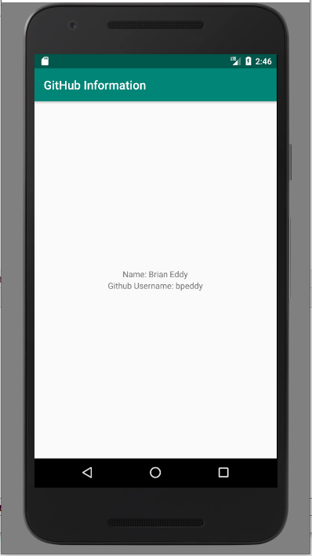

# Activity 1

## Purpose
The purpose of this activity is to get hands-on experience with Github and create and submit a basic application with a fragment.

## Github
Follow the video "Getting Started with Git in Android Studio" to setup your IDE for creating your activity. You may be required to install [Git](https://git-scm.com/downloads) first.  

## Description

This is a simple application intended primarily to familiarize yourself with course submission and to allow us to receive details for grading. For this assignment, create an application with a single activity and a single fragment. The fragment should display your name and your GitHub username as shown in the image below. 

## Submitting work
Once your program is working as expected, in Android Studio you need to create a commit and push the assignment as shown in the video.

I will pull all of the repositories from Github sometime after the deadline. This is the same for projects. 
Commit and push to origin early and often each time you get a block of code working as desired.
When I pull down the code after the deadline, it will pull down the most recent version of the code not your partially completed version(s).
This is also useful if you are stuck and need my help, you can push your code to Github and I can pull it onto my machine to take a look at it.
